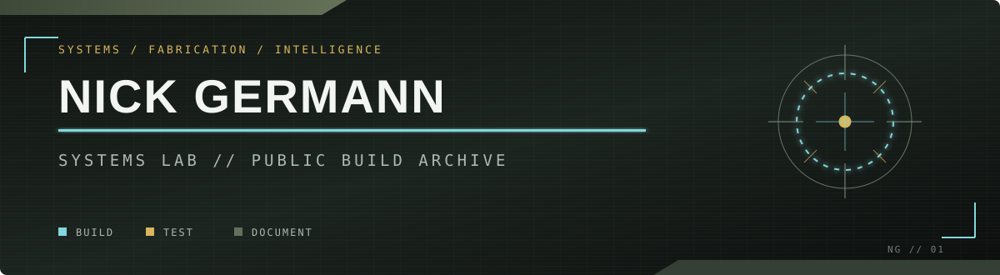
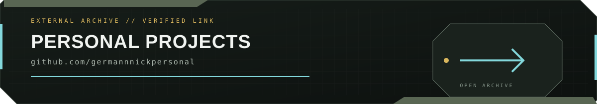

<div align="center">
  
</div>

<br />

<div align="center">

`BUILD` &nbsp;/&nbsp; `TEST` &nbsp;/&nbsp; `DOCUMENT` &nbsp;/&nbsp; `DEPLOY`

**Software for ambitious physical builds, intelligent tools, and field-ready systems.**

</div>

---

### `01 // PROFILE`

I build at the intersection of **software, physical systems, and applied AI**. My work is driven by a simple standard: make the system useful, make its behavior understandable, and leave behind documentation that lets someone else build on it.

This profile is the public archive for projects ranging from prop electronics and lighting control to computer vision experiments, systems integration, and practical engineering tools.

```text
STATUS       ACTIVE
FOCUS        INTEGRATED SYSTEMS + APPLIED INTELLIGENCE
OPERATING    FLORENCE, ALABAMA
```


### `02 // ACTIVE BUILDS`

<table>
  <tr>
    <td width="50%" valign="top">
      <h3>BR PLATFORM</h3>
      <code>PROP SYSTEMS / INTERACTION / CONTROL</code>
      <br /><br />
      Public software and technical documentation for a Halo-inspired battle rifle build. The repository will track the control logic, system behavior, integration decisions, and lessons learned as the platform develops.
      <br /><br />
      <b>STATUS:</b> <code>DEVELOPMENT</code>
    </td>
    <td width="50%" valign="top">
      <h3>CASE LIGHTING SYSTEM</h3>
      <code>LIGHTING / AUTOMATION / INTERFACE</code>
      <br /><br />
      A programmable case-lighting project focused on deliberate visual states, reliable control, and clean hardware/software integration. Build notes and source will come online with the public repository.
      <br /><br />
      <b>STATUS:</b> <code>DEVELOPMENT</code>
    </td>
  </tr>
</table>


### `03 // CAPABILITY MAP`

| SYSTEMS | INTELLIGENCE | EXECUTION |
|:--|:--|:--|
| Hardware/software integration | Computer vision | Technical troubleshooting |
| Implementation support | Model experimentation | Data cleanup + validation |
| Mesh network routing support | Pretrained model integration | Operational workflow analysis |
| Inventory + asset tracking | Small-scale AI training | Practical field deployment |


### `04 // TOOLCHAIN`

<p>
  
  
  
  
  
</p>


### `05 // PERSONAL PROJECTS`

Personal builds and exploratory work are maintained in a separate public archive.

<div align="center">
  <a href="https://github.com/germannnickpersonal">
    
  </a>
</div>

<div align="center">
  <a href="https://github.com/germannnickpersonal"><strong>OPEN @germannnickPersonal</strong></a>
</div>


### `06 // BUILD STANDARD`

```text
[01] Solve the real problem.
[02] Treat integration as part of the design.
[03] Test behavior, not assumptions.
[04] Document the decisions that matter.
[05] Ship work another builder can understand.
```

---

<div align="center">
  <sub>ENGINEERING NOTES / SOURCE CODE / BUILD DOCUMENTATION</sub>
  <br />
  <sub>More systems will be declassified as their repositories come online.</sub>
</div>

<!--
THEME NOTES
Graphite / armor black chassis, military green panels, cyan system lighting,
and restrained gold accents. Inspired by the finish language and project
photography of Precision Marksmanship Tech's Cerakote applicator gallery:
https://www.cerakote.com/applicators/373715/precision-marksmanship-tech
-->
